# sanos

Smooth, arbitrage-aware option surface calibration for Rust.

The public crate is [`sanos`](https://crates.io/crates/sanos). This repository also
contains the surrounding workspace tooling used to run calibrations, export surfaces,
and generate diagnostics.

## Release 0.2.0 highlights

- richer crate documentation with calibration galleries
- examples showing price fit, IV fit, density, and quality diagnostics
- benchmark-backed showcase examples from multiple market regimes
- reproducible release workflow for crates.io publication

## Why Rust users may care

`sanos` is designed for developers who want a native Rust surface-calibration engine:

- validated option market data types
- high-level calibration entry points
- queryable calibrated surfaces
- explicit no-arbitrage diagnostics
- optional serialization support

## Calibration gallery

Selection driven by the latest benchmark results:
- best `excellent` positive-spread case
- best `acceptable` case outside `tight_spread`
- best `excellent` term-structure case

### `sabr_catalog_02_equity_like_moderate_skew` with `tight_spread`

Price fit:

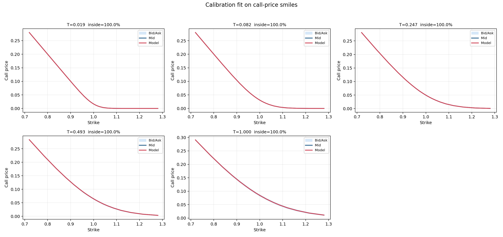

IV fit:

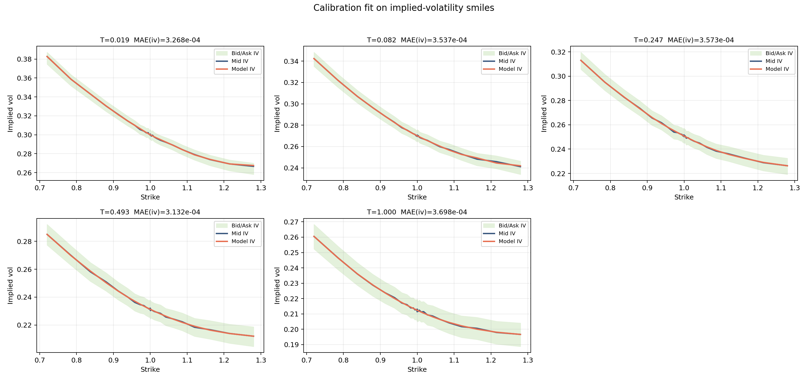

Density:

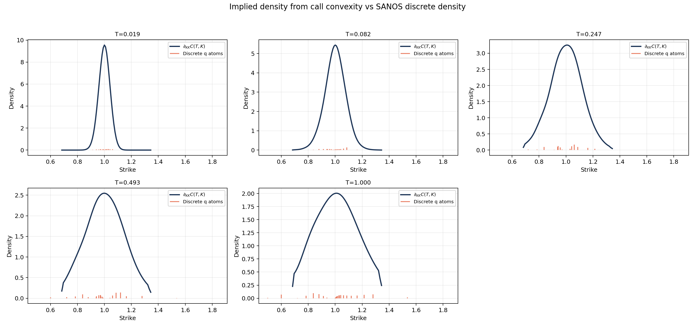

Performance summary:

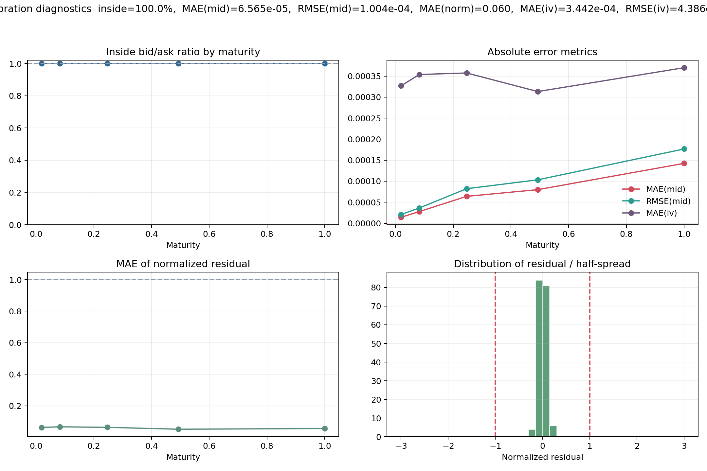

### `svi_raw_catalog_06_shifted_smile_center_right_long_end_focus` with `strong_wings`

Price fit:

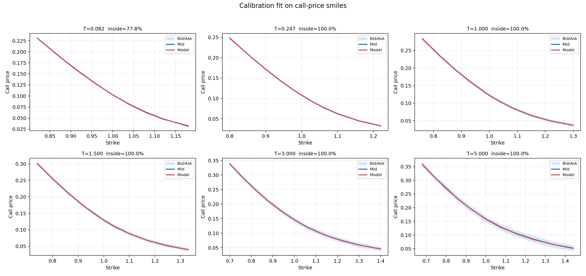

IV fit:

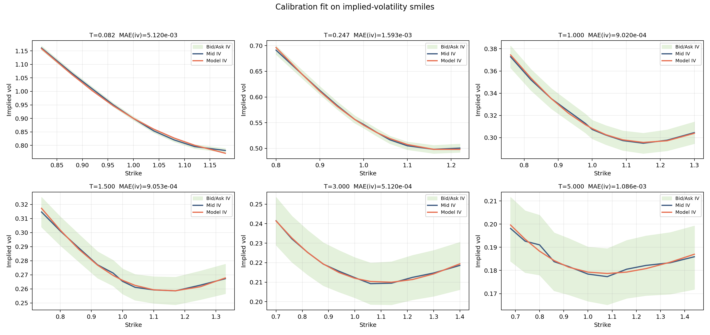

Density:

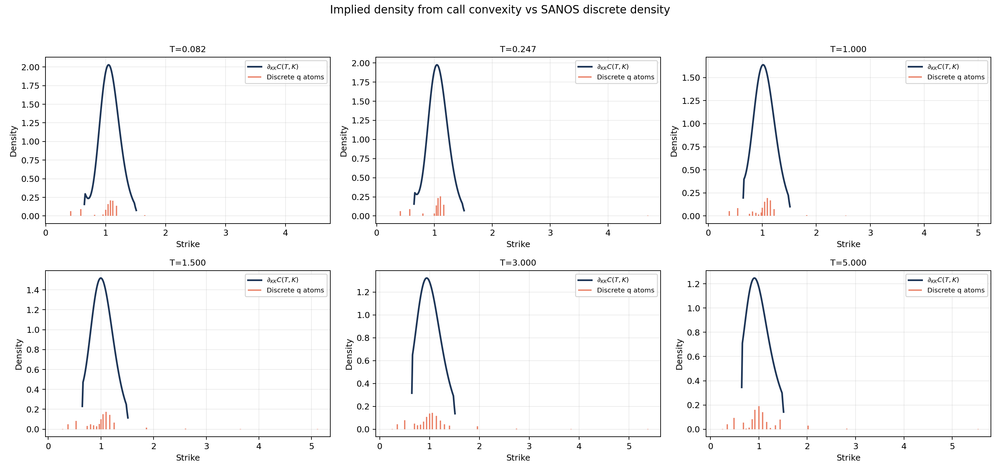

Performance summary:

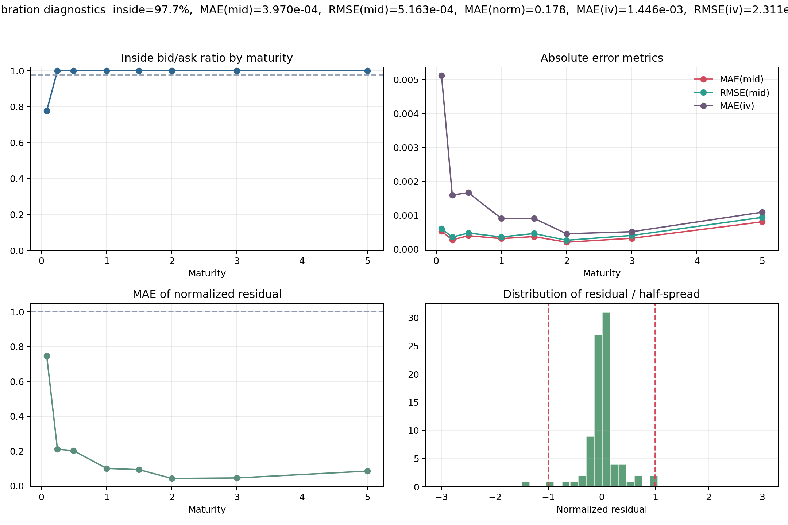

### `tv_catalog_07_inverted_term_structure` with `tight_spread`

Price fit:

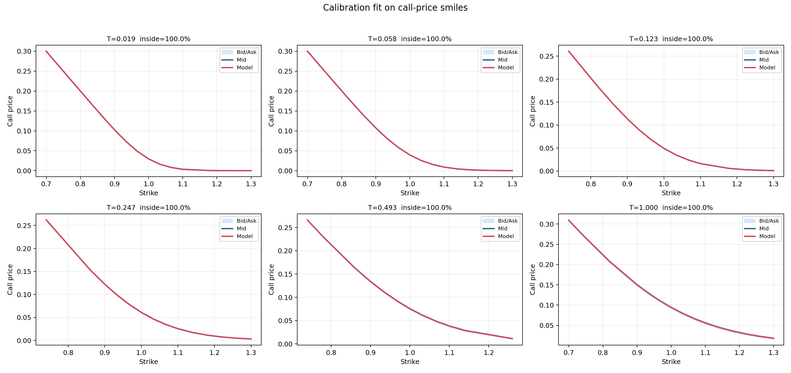

IV fit:

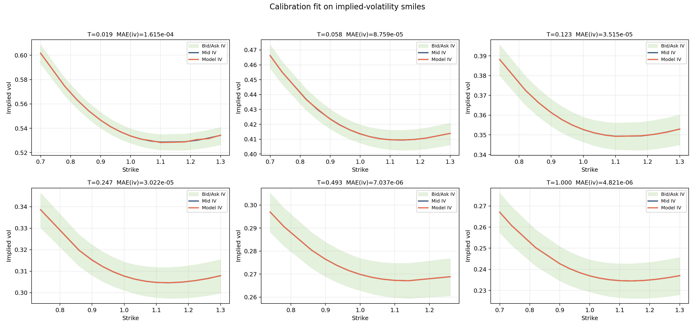

Density:

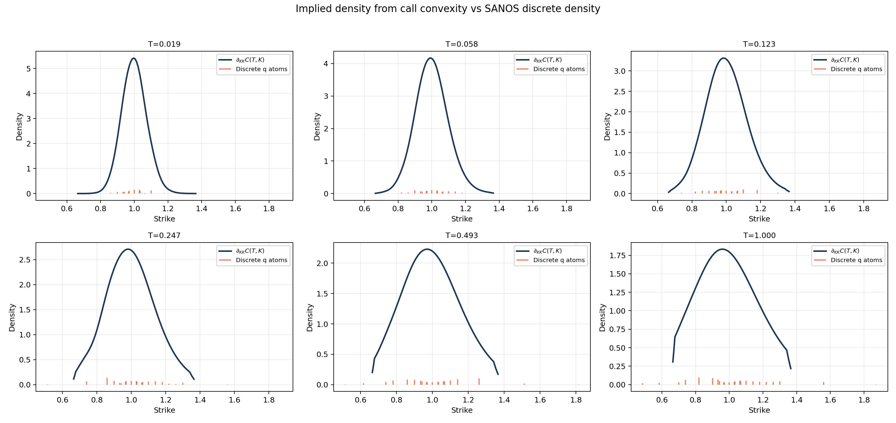

Performance summary:

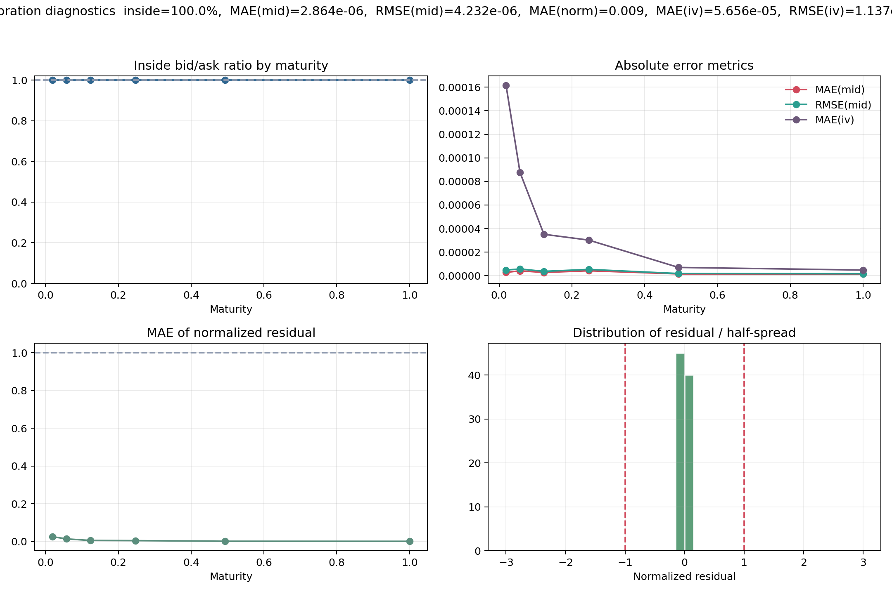

## Current benchmark snapshot study

The current benchmark study reports:

- 30 snapshots analyzed
- 5 zero-spread snapshots
- 0 real failures
- 9 fragile stress cases still useful for tuning

Best config counts from the latest benchmark run:

| Config | Best snapshots |
|---|---:|
| `tight_spread` | 16 |
| `sparse_robust` | 6 |
| `strong_wings` | 4 |
| `extreme_stress` | 2 |
| `zero_spread_vega` | 2 |

## Install the crate

```toml
[dependencies]
sanos = "0.2"
```

## Rust CLI

Build and run with `cargo run -p sanos-cli -- <command> ...`.

### Commands

1. Create a default calibration config:
```bash
cargo run -p sanos-cli -- init-config --out data/configs/default.json
```
This template is runnable out of the box (`solver = "Microlp"`, `objective = "HardBidAsk"`).

2. Validate a snapshot:
```bash
cargo run -p sanos-cli -- validate-snapshot --snapshot data/snapshots/my_snapshot.json
```

3. Run calibration + JSON exports:
```bash
cargo run -p sanos-cli -- calibrate \
  --snapshot data/snapshots/my_snapshot.json \
  --config data/configs/default.json \
  --out data/surfaces/my_run \
  --n-maturities 41 \
  --n-strikes 81
```

This writes:
- `report.json`
- `q.json`
- `surface.json` (dense and pretty-printed, includes `reconstruction` to rebuild `SanosSurface`)
- `diagnostics.json`

4. Validate and reconstruct a previously exported surface:
```bash
cargo run -p sanos-cli -- validate-surface --surface data/surfaces/my_run/surface.json
```

## Python orchestrator (`sanos run`)

The top-level orchestrator is Python and does not create Rust dependencies on `tools/`.

```bash
python tools/sanos.py run --config default --snapshot my_snapshot
```

Catalog run:
```bash
python tools/sanos.py run --config default --snapshot-catalog total_variance
```

Catalog run with per-snapshot config rules + fallback:
```bash
python tools/sanos.py run --config-catalog total_variance_robust --snapshot-catalog total_variance
```

Catalog run with automatic best-config scoring:
```bash
python tools/sanos.py run --config-catalog total_variance_robust --snapshot-catalog total_variance --selection-policy best-score
```

Shortcuts:
- Windows (from repo root): `sanos.cmd run --config default --snapshot my_snapshot`
- Linux/macOS (from repo root): `./sanos run --config default --snapshot my_snapshot`

Single snapshot resolves:
- `data/configs/default.json`
- `data/snapshots/my_snapshot.json`

Then it:
1. Validates the snapshot.
2. Runs calibration via Rust CLI.
3. Writes JSON outputs in `data/surfaces/<snapshot>__<config>/`.
4. Generates calibration quality plots in `data/images/<snapshot>__<config>/`.
5. Generates a Markdown report in `data/reports/<snapshot>__<config>.md`.

Catalog run resolves:
- `data/configs/default.json`
- `data/snapshots/catalogs/total_variance/*.json`

Then it runs each snapshot and writes:
- Surfaces: `data/surfaces/catalogs/<catalog>/<snapshot>__<config>/`
- Images: `data/images/catalogs/<catalog>/<snapshot>__<config>/`
- Per-run reports: `data/reports/catalogs/<catalog>/<snapshot>__<config>.md`
- Batch summary report: `data/reports/catalogs/<catalog>/<catalog>__<config-or-catalog-label>__summary.md`

If `--config-catalog` is used:
- Resolves `data/config_catalogs/<catalog>.json`
- Picks config candidates per snapshot name (regex rules), then tries them in order
- `--selection-policy first-success` stops at first successful calibration
- `--selection-policy best-score` runs all successful candidates and picks the lowest score
- Score favors: high inside bid/ask, low normalized residuals, smoother IV, low bid/ask and no-arb violations
- Records effective config and score used in the batch summary table

Optional flags:
- `--no-validate`
- `--no-plot`
- `--n-maturities`
- `--n-strikes`
- `--selection-policy`
- `--score-w-*` (weights for the best-score objective)
- `--keep-attempt-artifacts` (desactive le nettoyage des essais non retenus)

## Calibration Config Notes

- `convex_order_validation`: `"Error"` (default) or `"Warn"`.
- `fit.kernel.omega`: `"Zero"`, `"One"`, or `"Both"` (`"Both"` enforces both constraint blocks in the same LP).
- `fit.initialization.mode`: `"None"` (default) or `"BackboneSynthetic"`.
- `fit.initialization.feasibility_tol`: non-negative finite tolerance for warm-start feasibility checks.
- `fit.initialization.market_completion`: Remark 2.8 completion config (defaults applied if omitted), used only when `mode = "BackboneSynthetic"`.

Minimal example:
```json
{
  "convex_order_validation": "Warn",
  "fit": {
    "kernel": { "omega": "One" },
    "objective": "HardBidAsk",
    "initialization": {
      "mode": "None",
      "price_proxy": "Mid",
      "feasibility_tol": 1e-8,
      "market_completion": {
        "k1_ratio": 0.2,
        "kN_ratio": 2.0,
        "max_iters": 50,
        "slope_margin": 1e-10,
        "hard_caps": null,
        "tol": 1e-10
      }
    }
  }
}
```
